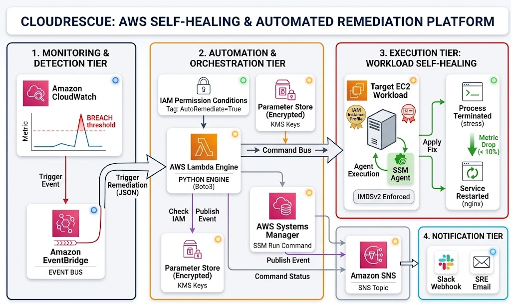

# AWS Self-Healing Cloud Infrastructure

## Project Overview

This project demonstrates a self-healing AWS infrastructure that automatically detects high CPU utilization on an EC2 instance and performs an automated recovery action.

The project uses Amazon CloudWatch for monitoring, Amazon SNS for notifications, and an EC2 automated reboot action for remediation.

## Project Objective

The objective is to:

1. Monitor EC2 CPU utilization.
2. Detect high CPU usage.
3. Trigger a CloudWatch alarm.
4. Send an email notification through SNS.
5. Automatically reboot the EC2 instance.
6. Verify that the instance recovers successfully.

## Architecture



### Workflow

```text
EC2 Instance
     |
     | CPU utilization
     v
CloudWatch
     |
     | CPU > 80%
     v
CloudWatch Alarm
     |
     +-------------> SNS Email Notification
     |
     v
EC2 Reboot Action
     |
     v
EC2 Recovery
     |
     v
CloudWatch returns to OK
AWS Services Used
Service	Purpose
Amazon EC2	Runs the Linux server
Amazon CloudWatch	Monitors CPU utilization
Amazon SNS	Sends email notifications
AWS Systems Manager	Provides secure access to the EC2 instance
Amazon VPC	Provides networking
Amazon EBS	Provides EC2 storage
EC2 Configuration
Operating System: Amazon Linux
Instance Type: t3.micro
Monitoring: Amazon CloudWatch
Access: AWS Systems Manager Session Manager
Storage: EBS
Region: ap-south-1
CloudWatch Alarm

Alarm name:

CloudRescue-HighCPU-SelfHealing

Configuration:

Metric: CPUUtilization
Statistic: Average
Period: 5 minutes
Threshold: Greater than 80%
Evaluation: 2 out of 2 datapoints
Alarm action: Reboot EC2 instance
Notification: SNS email
Testing

The self-healing mechanism was tested by intentionally generating high CPU utilization on the EC2 instance using stress-ng.

stress-ng --cpu 2 --timeout 12m
Testing Flow
CPU Load Generated
        |
        v
CPU Utilization > 80%
        |
        v
CloudWatch Alarm
        |
        v
ALARM State
        |
        +------> SNS Email
        |
        +------> EC2 Reboot
                    |
                    v
              EC2 Recovery
                    |
                    v
             Alarm returns OK
Project Evidence
EC2 Instance

CloudWatch Alarm

Alarm History

SNS Email Notification

EC2 Recovery

Project Report

A detailed implementation report is available here:

Project Implementation Report

The report contains the implementation steps, configuration, testing process, screenshots, and results.

Repository Structure
AWS-self-healing-cloud-infrastructure/
|
+-- architecture/
|   +-- Self-healing-architecture3.jpg
|
+-- docs/
|   +-- project-implementation-report.pdf
|
+-- screenshots/
|   +-- 01-ec2-instance.png
|   +-- 02-cloudwatch-alarm.png
|   +-- 03-alarm-history-1.png
|   +-- 03-alarm-history-2.png
|   +-- 04-sns-email-1.png
|   +-- 04-sns-email-2.png
|   +-- 05-recovery-1.png
|   +-- 05-recovery-2.png
|
+-- scripts/
|   +-- cpu-stress-test.sh
|
+-- .gitignore
+-- README.md
Skills Demonstrated
AWS EC2
Amazon CloudWatch
Amazon SNS
AWS Systems Manager
Linux
Bash scripting
Monitoring and alerting
Automated remediation
Git and GitHub
AWS infrastructure troubleshooting
Result

The project successfully demonstrates the following self-healing workflow:

Monitor -> Detect -> Notify -> Remediate -> Recover

High CPU utilization was generated using stress-ng. CloudWatch detected the condition, SNS provided email notification, and the configured EC2 reboot action provided automated remediation.

Future Improvements
Terraform Infrastructure as Code
Automated infrastructure deployment
CloudWatch dashboards
Additional monitoring alarms
Advanced Systems Manager remediation
CI/CD integration
Project Status

AWS infrastructure: Completed

CloudWatch monitoring: Completed

SNS notification: Completed

Automated EC2 recovery: Completed

Testing: Completed

Documentation: Completed

GitHub repository: Completed

Terraform: Next phase
'@ | Set-Content -Encoding UTF8 .\README.md
